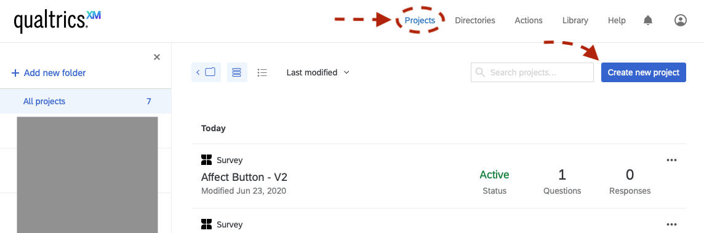
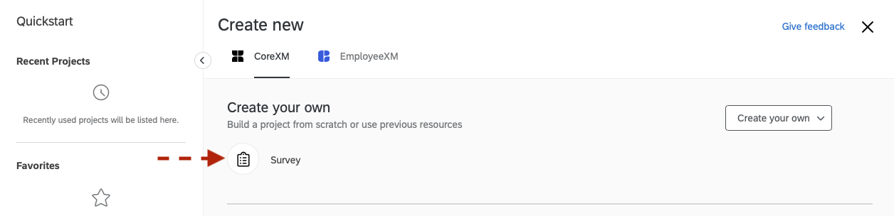
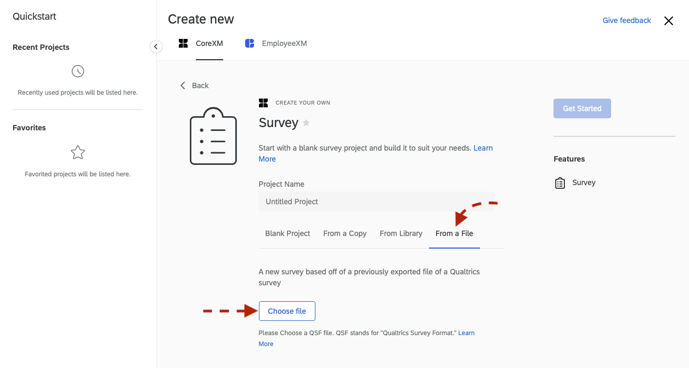
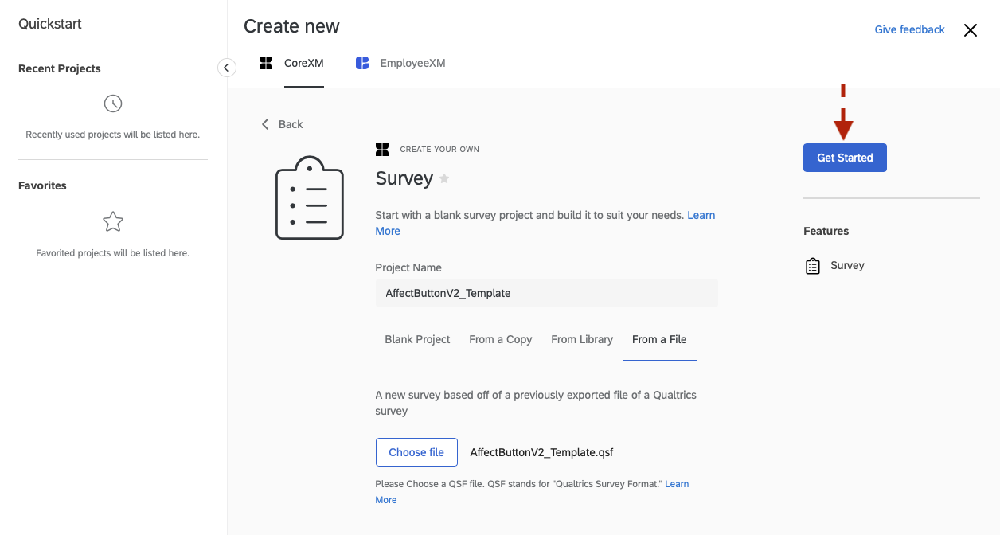
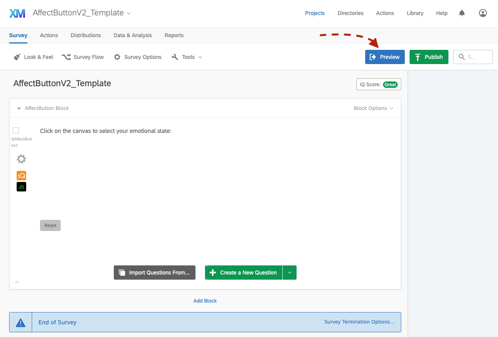
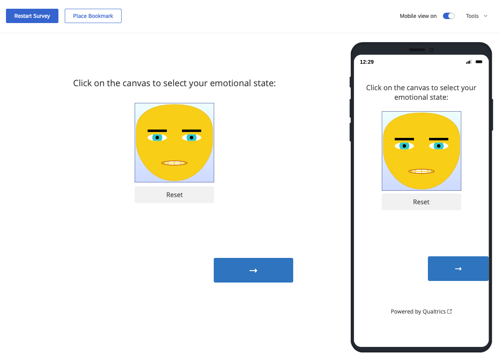
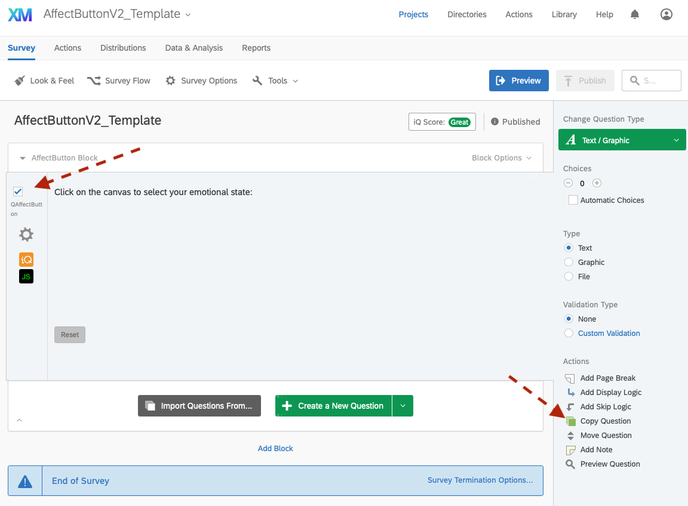
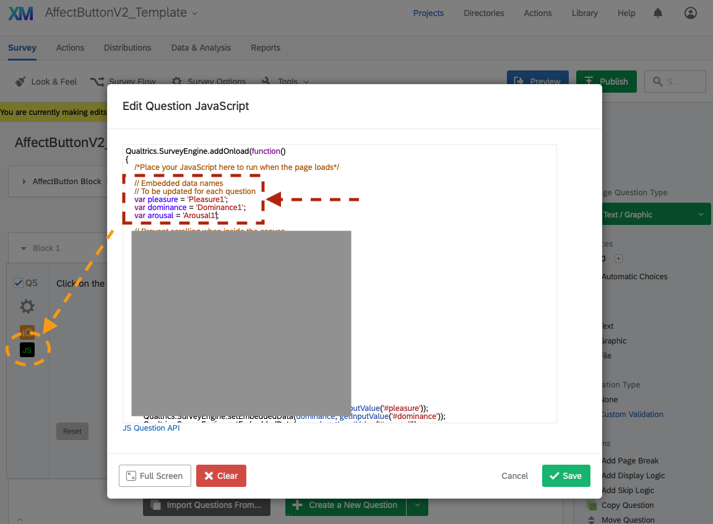
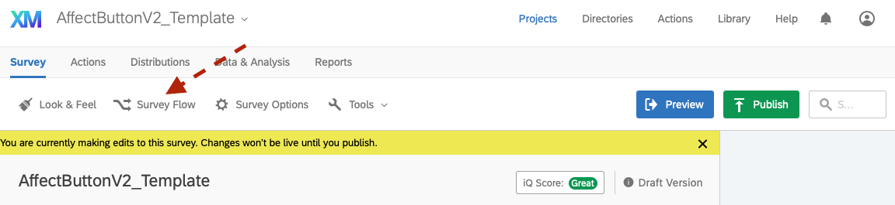
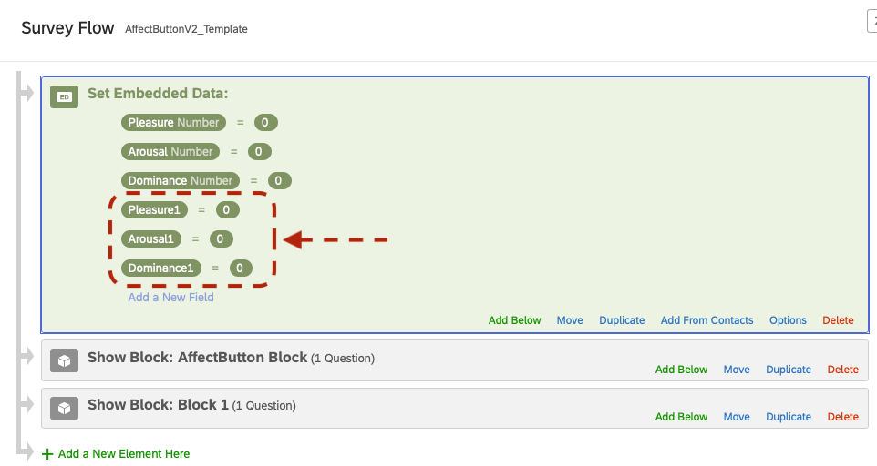

# Using the AffectButton in Qualtrics Surveys

---

The affect button is used to collect users feedback via reporting their emotional state. It is based on the work by [Broekens et al.](http://joostbroekens.com).

In the following, we provide a step-by-step guide for using the affect button in a Qualtrics survey. 
Note that in this guide we're using the affect template as a starting point for a new survey.

## I. Create a Qualtrics Survey using the AffectButton Template

  * Download the file: **[AffectButtonV2_Template.qsf](https://github.com/ES-TUDelft/affectbutton-qualtrics/blob/master/AffectButtonV2_Template.qsf)** (e.g., right click on *Raw* and download the file, then set the extension to .qsf if Git makes it .txt)
  
  * Open [Qualtrics.com](https://qualtrics.com) and login to your account (or create a new one)
  
  * Go to the **Projects** page
  
  

   
  

  
  * Click on **Create New Project**
  
  * Click on **Survey**
  
  

   
  

  
  * Select **From a File** then click on **Choose file** and locate the *AffectButtonV2_Template.qsf* file you downloaded in step 1
  
  

   
  

  
  * Click on **GetStarted**
  
  

   
  

  
  * A new project based on the AffectButton template will be created (you can change the name to your liking)
  
  

   
  

  
  * Click on **Preview** to check/test the AffectButton

  * The template provides you with one affect button and its corresponding data (Pleasure, Arousal and Dominance).
  
  

   
  

  
---

## II. Survey Design

After testing the affect button (Step I), you can now add new blocks/questions to the survey. 

---

## III. Using more than one AffectButton (optional)

In case you need **more than one AffectButton** in a survey, you need to do the following:

  * a. Select the question **"QAffectButton**
  
  

   
  

  
  * b. Click on **Copy Question**
  
  * c. Move the new AffectButton (i.e., question) to a *new block* (only one affect button is allowed per block)
  
  * d. Click on the **JavaScript (JS) icon** of the new AffectButton to open the javascript editor
  
  

   
  

  
  * e. Set the variables for Pleasure, Arousal and Dominance by appending a number to them (e.g., 1), then save your changes
  
  * f. Select **Survey Flow**
  
  

   
  

  
  * g. Add 3 **new embedded data** with names matching the ones from ***Step e*** and save your changes
  
  

   
  

  
  * h. Preview your survey and submit a copy to check that the data is collected as expected (i.e., the AffectButton values are being stored in the Reports)
  
  
---

## IV. Integrating the AffectButton into an existing survey

This option requires modifying your survey's header scripts and CSS (to match the AffectButton template), which can be done as follows:

 * i. In Qualtrics, open a pre-existing survey (or create a new project)
 
 * ii. Click on **Look & Feel** and do:
   
   * Select **General** => in **Header** click on **edit** then copy/paste the contents of the file [src/js/header.js](https://github.com/ES-TUDelft/affectbutton-qualtrics/blob/master/src/js/header.js) in the Header **source <>** content box (*remember to save your changes*)
  
   * Select **Style** => then copy/paste the contents of the file [src/css/custom.css](https://github.com/ES-TUDelft/affectbutton-qualtrics/blob/master/src/css/custom.css) in the **Custom CSS** content box (*remember to save your changes*)

 * iii. In the survey, create a new Question and change its type to text (e.g., Descriptive Text)
 
 * iv. Edit the question content by clicking on its **Rich Content Editor**
  
   * Select the **Source <>** then copy/paste the contents of the html file [src/html/affectbutton-question.html](https://github.com/ES-TUDelft/affectbutton-qualtrics/blob/master/src/html/affectbutton-question.html) into the content box
   
 * v. Edit the question JavaScript by clicking on its **JS** icon
 
   * Copy/Paste the contents of the file [src/js/affectbutton-qualtrics.js](https://github.com/ES-TUDelft/affectbutton-qualtrics/blob/master/src/js/affectbutton-qualtrics.js) into the javascript editor, then save your changes
   
 * vi. Create 3 embedded data to store the AffectButton values
 
   * Click on **Survey Flow**
   
   * Click on **+Add a New Element Here** and select **Embedded Data**
   
   * Move the new Embedded Data element to be at the beginning of the flow and create **3 Embedded Data** (i.e., Pleasure, Dominance and Arousal)
   
   * Save the flow
   
 * vii. Click on **Preview** to check that the survey is working as expected
 

*Good Luck!*
 
---

## V. Citation

Please cite Broekens et al. when you use the AffectButton in your studies:

    @article{Broekens2013,
      author = "Joost Broekens and Willem-Paul Brinkman",
      title = "AffectButton: A method for reliable and valid affective self-report",
      journal = "International Journal of Human-Computer Studies",
      volume = "71",
      number = "6",
      pages = "641 - 667",
      year = "2013",
      issn = "1071-5819",
      doi = "https://doi.org/10.1016/j.ijhcs.2013.02.003",
      url = "http://www.sciencedirect.com/science/article/pii/S1071581913000220"
    }
