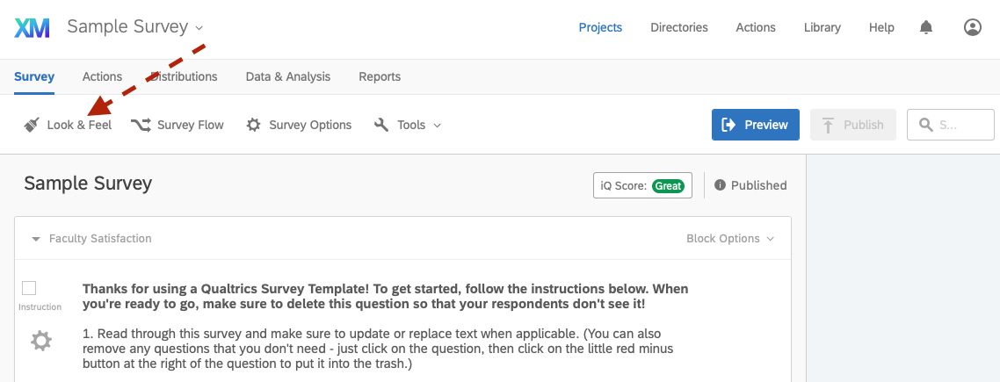
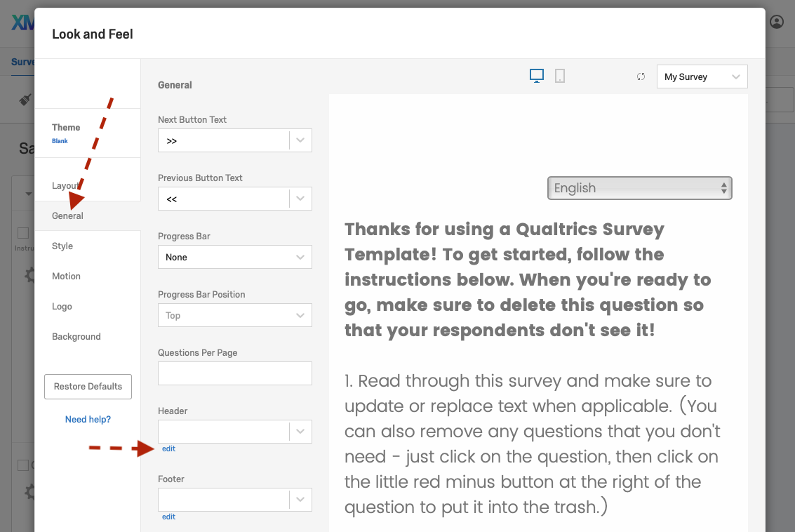
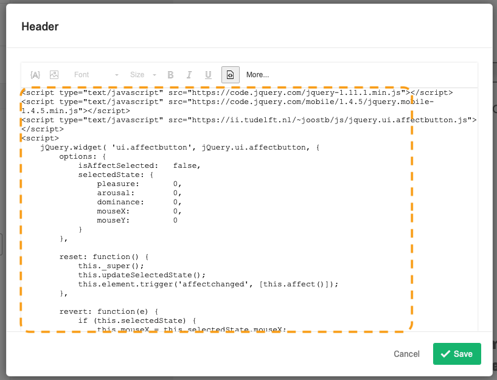
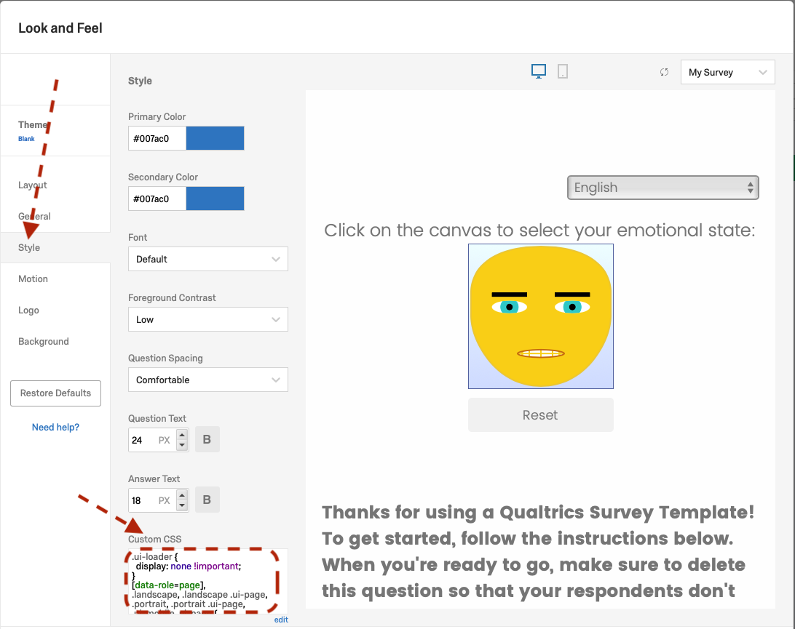
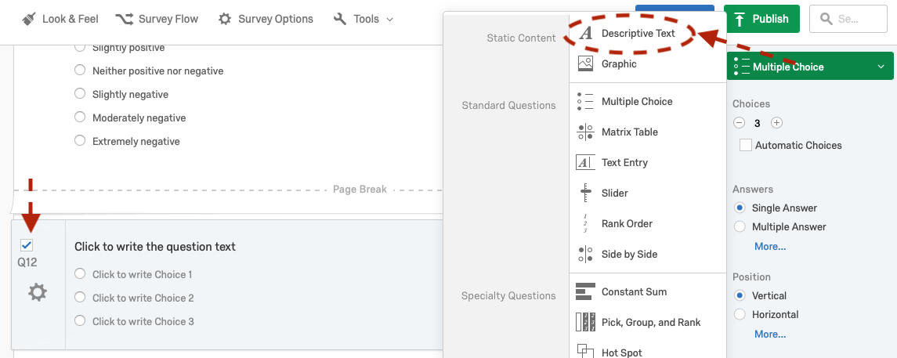
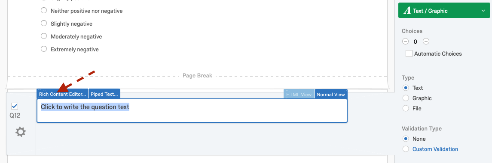
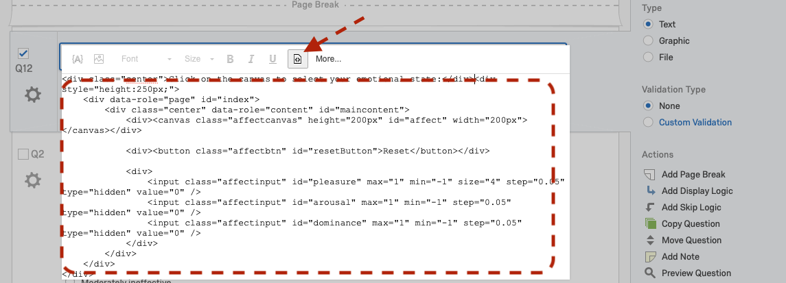
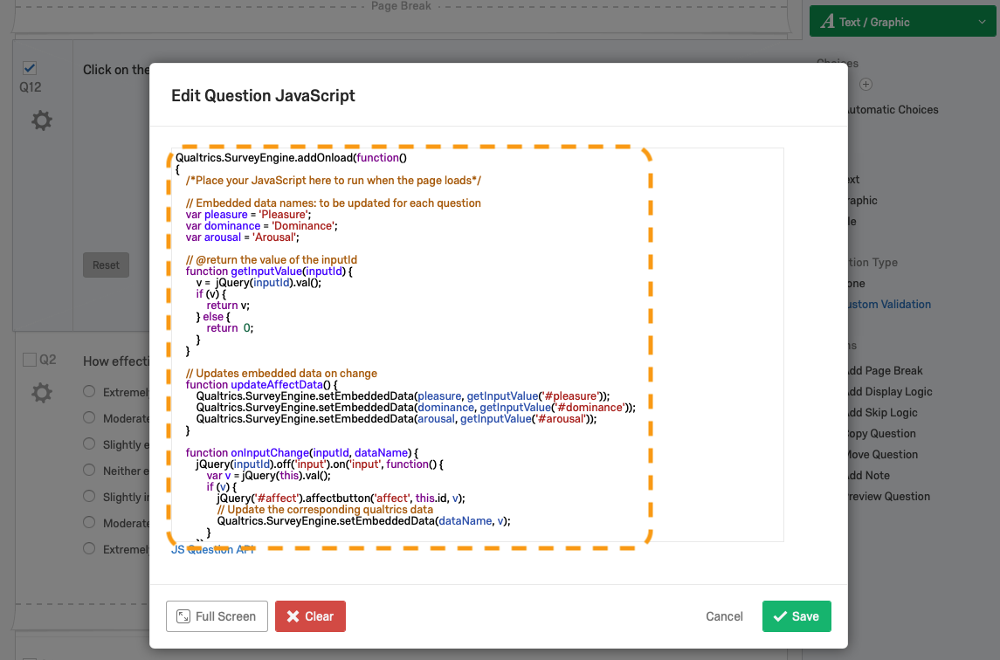
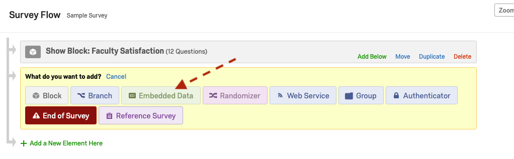
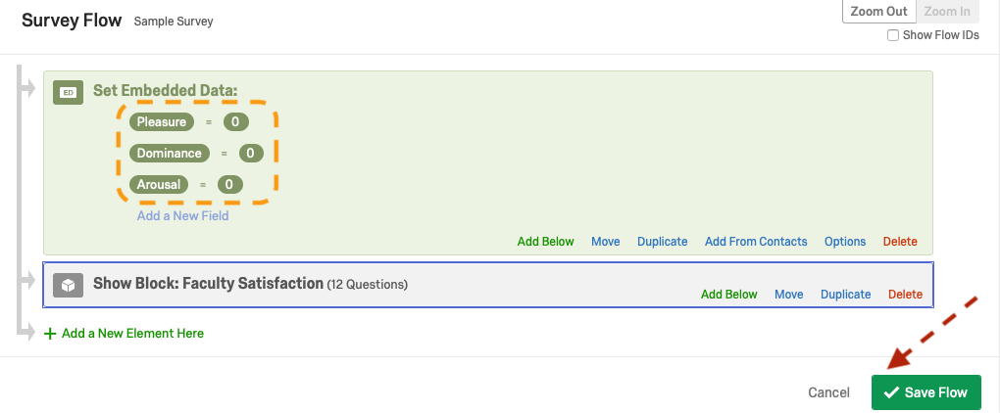

# Using the AffectButton in Qualtrics Surveys

---

The AffectButton is used to collect users' feedback via reporting their emotional state. It is based on the work by <a href="http://joostbroekens.com/" target="_blank">Broekens et al.</a> [[1]](#v-citation).

In the following, we provide a step-by-step guide for using the AffectButton in a Qualtrics survey.

---

## Content

**I.** [Create a Qualtrics Survey using the AffectButton Template](#i-create-a-qualtrics-survey-using-the-affectbutton-template)

**II.** [Survey Design](#ii-survey-design)

**III.** [Using more than one AffectButton (optional)](#iii-using-more-than-one-affectbutton-optional)

**IV.** [Integrating the AffectButton into an existing survey](#iv-integrating-the-affectbutton-into-an-existing-survey)

**V.** [Know Issues](#v-known-issues)

**VI.** [Citation](#vi-citation)

---

## I. Create a Qualtrics Survey using the AffectButton Template

  * Download the file: **[AffectButtonV2_Template.qsf](https://github.com/ES-TUDelft/affectbutton-qualtrics/blob/master/AffectButtonV2_Template.qsf)** (e.g., **right-click** on *Raw* and select *Download Linked File*; then go to the file and set its extension to .qsf if Git makes it .txt)
  
  * Open [Qualtrics.com](https://qualtrics.com) and login to your account (or create a new one)
  
  * Go to the **Projects** page
  
  

   
  

  
  * Click on **Create New Project**
  
  * Click on **Survey**
  
  

   
  

  
  * Select **From a File** then click on **Choose file** and locate the *AffectButtonV2_Template.qsf* file you downloaded in step 1
  
  

   
  

  
  * Click on **Get Started**
  
  

   
  

  
  * A new project based on the AffectButton template will be created (you can change the name to your liking)
  
  

   
  

  
  * Click on **Preview** to check/test the AffectButton

  * The template provides you with one AffectButton and its corresponding data (Pleasure, Arousal and Dominance).
  
  

   
  

  
---

## II. Survey Design

After testing the AffectButton (Step I), you can now add new blocks/questions to the survey. 

---

## III. Using more than one AffectButton (optional)

In case you need **more than one AffectButton** in a survey, you need to do the following:

  * a. Select the question **"QAffectButton**
  
  

   
  

  
  * b. Click on **Copy Question**
  
  * c. Move the new AffectButton (i.e., question) to a *new block* (only one affect button is allowed per block)
  
  * d. Click on the **JavaScript (JS) icon** of the new AffectButton to open the javascript editor
  
  

   
  

  
  * e. Set the variables for Pleasure, Arousal and Dominance by appending a number to them (e.g., 1), then save your changes
  
  * f. Select **Survey Flow**
  
  

   
  

  
  * g. Add 3 **new embedded data** (i.e., click on *Add a New Field*) with names matching the ones from ***Step e*** and save your changes
  
  

   
  

  
  * h. Preview your survey and submit a copy to check that the data is collected as expected (i.e., the AffectButton values are being stored in the Reports)
  
  
---

## IV. Integrating the AffectButton into an existing survey

This option requires modifying your survey's header scripts and CSS (to match the AffectButton template), which can be done as follows:

 **i.** In Qualtrics, open a pre-existing survey (or create a new project)
 
 **ii.** Click on **Look & Feel** and do the following changes in *General* and *Style*:
   
  

   
  

  

   
  

  
   * Select **General** => in **Header** click on **edit** then copy/paste the contents of the file [src/html/header.html](https://github.com/ES-TUDelft/affectbutton-qualtrics/blob/master/src/html/header.html) in the Header **source <>** content box (*remember to save your changes*)
   
  

   
  

   * Select **Style** => then copy/paste the contents of the file [src/css/custom.css](https://github.com/ES-TUDelft/affectbutton-qualtrics/blob/master/src/css/custom.css) in the **Custom CSS** content box (*remember to save your changes*)

  

   
  

  
 **iii.** In the survey, create a new Question and change its type to text (e.g., Descriptive Text)
 
  

   
  

  
 **iv.** Edit the question content by clicking on its **Rich Content Editor**
  
  

   
  

  
   * Select the **Source <>** then copy/paste the contents of the html file [src/html/affectbutton-question.html](https://github.com/ES-TUDelft/affectbutton-qualtrics/blob/master/src/html/affectbutton-question.html) into the content box
   
  

   
  

  
 **v.** Edit the question JavaScript 
  
   * Click on the **Advanced Question Options** (i.e., settings icon) and select the **JS Add Javascript** option
  
  

   
  

  
   * Copy/Paste the contents of the file [src/js/affectbutton-qualtrics.js](https://github.com/ES-TUDelft/affectbutton-qualtrics/blob/master/src/js/affectbutton-qualtrics.js) into the javascript editor (i.e., replacing the js code that was there), then save your changes
    
  

   
  

  
 **vi.** Create 3 embedded data to store the AffectButton values:
 
   - Click on **Survey Flow**
   
   - If you already have an *Embedded Data Block* click on it and go to the next step; otherwise, click on **+Add a New Element Here** and select **Embedded Data**, then move the new Embedded Data block to the beginning of the flow (i.e., before any other block).
       
  

   
  

  
   *  Create **3 Embedded Data** (i.e., Pleasure, Dominance and Arousal). 
   
  

   
  

  
   * Save the flow
   
 **vii.** Click on **Preview** to check that the survey is working as expected
 

*Good Luck!*
 
---

## V. Known Issues

A duplicate of the "next" button may appear on some of the pages.
You can do the following to fix the issue:

 * Click on the first (or last) question of a block and go to “Rich Content Editor” 
 
 * Click on Source <>
 
 * Paste the following at the end: 
	
   `

&nbsp;

`

You can apply the fix to every page with a double next button (i.e., by adding the div to the first OR last question of a block).

---

## VI. Citation

Please cite Broekens et al. when you use the AffectButton in your studies:

 * [1] Broekens, J., & Brinkman, W.-P. (2013). AffectButton: a method for reliable and valid affective self-report. International Journal of Human-Computer Studies, 71(6), 641-667.

       @article{Broekens2013,
         author = "Joost Broekens and Willem-Paul Brinkman",
         title = "AffectButton: A method for reliable and valid affective self-report",
         journal = "International Journal of Human-Computer Studies",
         volume = "71",
         number = "6",
         pages = "641 - 667",
         year = "2013",
         issn = "1071-5819",
         doi = "https://doi.org/10.1016/j.ijhcs.2013.02.003",
         url = "http://www.sciencedirect.com/science/article/pii/S1071581913000220"
       }
